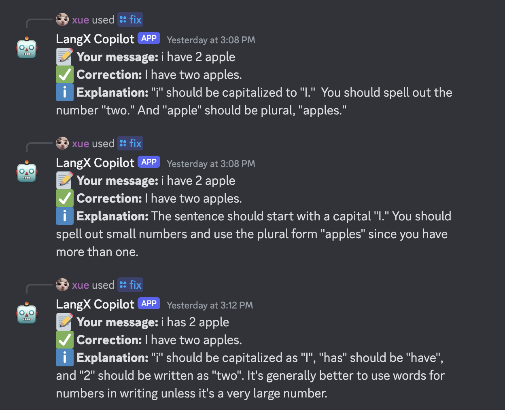

# :robot: LangX Copilot

LangX Copilot is an innovative AI-powered tool designed to enhance your language learning journey. This feature-rich platform offers personalized feedback to improve your language skills in real-time. LangX Copilot ensures your privacy while providing corrections and explanations directly to you.

## Demo

You can try out LangX Copilot in the [#copilot channel](https://discord.langx.io) on Discord.



## What can it do?

- :construction: **Grammar Correction**: The bot can correct grammar mistakes in your messages.
- :hourglass_flowing_sand: **Suggest Next Message**: The bot can suggest what to say next based on the context of the conversation.
- :hourglass_flowing_sand: **Better Way to Say**: The bot can suggest a better way to express your thoughts.
- :hourglass_flowing_sand: **Suggest New Topic**: The bot can suggest a new topic of conversation when the current topic has been exhausted.
- :hourglass_flowing_sand: **And more**: The bot has many more features to explore!

You can try it out in the [#copilot channel](https://discord.langx.io) on Discord.

## Features

- **Personalized Feedback**: Get real-time corrections and explanations to enhance your language learning.
- **Grammar Correction**: Automatically corrects grammar mistakes and provides detailed explanations.
- **Privacy Focused**: Feedback is provided confidentially, ensuring your privacy is maintained.
- **Supports Multiple Languages**: Not limited to English, LangX Copilot supports various languages for grammar correction.

## Getting Started

### Installation

1. **Clone the repository**:

   ```sh
   git clone
   cd copilot
   ```

2. **Copy `.env` file** with the following environment variables:

   ```sh
   cp .env.sample .env
   ```

3. **Fill in the environment variables** in the `.env` file:

   ```sh
   GEMINI_API_KEY=your_gemini_api_key
   ```

4. **Copy instructions.js.sample to instructions.js** and fill in your instructions:

   ```sh
   cp instructions.js.sample instructions.js
   ```

5. **Prepare the environment** by running the prebuild script:

   ```sh
   npm run prebuild
   ```

6. **Deploy Appwrite Functions**:

   1. Open the `appwrite.json` file in a text editor.
   2. Update the `projectName` field with your `projectId`.
   3. Save the changes to the appwrite.json file.
   4. Open a terminal or command prompt in the directory where your `appwrite.json` file is located.
   5. Install the Appwrite CLI by running the following command:

   ```sh
      npm install -g appwrite-cli
   ```

   6. Deploy the Appwrite functions by running the following command:

   ```sh
      appwrite deploy --functionId copilot
   ```

   Deploy the Appwrite functions, ensuring that the environment variables are correctly set during the deployment process. We utilize Git integration for deployment. For more information on deploying Appwrite functions, refer to the [Appwrite Functions Documentation](https://appwrite.io/docs/advanced/self-hosting/functions).

   > Please note that you need to have the Appwrite CLI installed and authenticated with your Appwrite project before running the appwrite functions deploy command.

### Discord Bot

Detailed instructions for installing and configuring the Discord bot are provided in a separate document. This includes steps for setting up your environment, configuring the bot, and deploying it to a server.

Please refer to the [Discord Bot Documentation](discord/README.md) for more information.

## Contributing

Feel free to contribute to this project and help us improve LangX Copilot. You can contribute by opening a PR or creating an issue easily.

We welcome all contributions, including bug fixes, new features, and improvements to the documentation.

## License

This project is licensed under BSD 3-Clause License. See the [LICENSE](LICENSE) file for more details.
