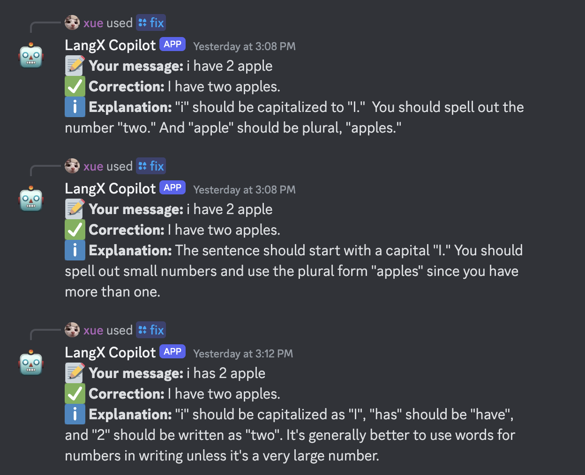

# :robot: LangX Copilot

## Discord Bot Documentation

LangX Copilot is an innovative AI-powered tool designed to enhance your language learning journey. This feature-rich platform offers personalized feedback to improve your language skills in real-time. LangX Copilot ensures your privacy while providing corrections and explanations directly to you.

## Demo

You can try out LangX Copilot in the [#copilot channel](https://discord.langx.io) on Discord.



## Features

- **Personalized Feedback**: Get real-time corrections and explanations to enhance your language learning.
- **Grammar Correction**: Automatically corrects grammar mistakes and provides detailed explanations.
- **Privacy Focused**: Feedback is provided confidentially, ensuring your privacy is maintained.
- **Supports Multiple Languages**: Not limited to English, LangX Copilot supports various languages for grammar correction.

## Getting Started

### Prerequisites

- Node.js (version 18 or later)
- npm (Node Package Manager)
- Cloudflare account with Workers enabled
- Discord account and bot set up in the Discord Developer Portal

### Installation

1. **Clone the repository**:

   ```sh
   git clone https://github.com/langx/copilot.git
   cd copilot
   ```

2. **Install dependencies**:

   ```sh
   npm install
   ```

3. **Copy `.env` file** with the following environment variables:

   ```sh
   cp .env.sample .env
   ```

4. **Fill in the environment variables** in the `.env` file:

   ```sh
   DISCORD_BOT_TOKEN=your_discord_token
   DISCORD_CLIENT_ID=your_discord_client_id
   GEMINI_API_KEY=your_gemini_api_key
   ```

5. **Set up the system instructions:**

   ```sh
   cp instructions.js.sample instructions.js
   ```

   Open the `instructions.js` file in your preferred text editor and edit the `systemInstruction` and `chatHistory` constant to include your own instructions.

6. **Run the application**:

   ```sh
   npm start discord
   ```

7. **Deploy the Bot (Optional)**:

   ```sh
   npm i pm2 -g
   node discord/registerCommands.js
   pm2 start discord/bot.js --name copilot
   ```

## Contributing

Feel free to contribute to this project and help us improve LangX Copilot. You can contribute by opening a PR or creating an issue easily.

We welcome all contributions, including bug fixes, new features, and improvements to the documentation.

## License

This project is licensed under BSD 3-Clause License. See the [LICENSE](LICENSE) file for more details.
